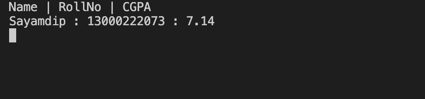
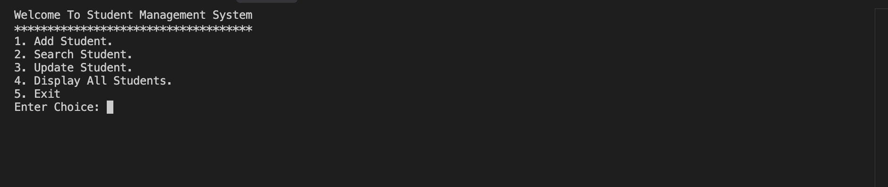

# 📚 Student Management System (C++)

## 📌 Overview
The **Student Management System** is a console-based application built in **C++** for managing student records.  
It allows users to:
- Add new students
- Search for a student by roll number
- Update student details
- Display all stored students

This project uses **file handling** to store student data persistently and **OOP concepts** (classes & encapsulation) for better code organization.

---

## 🛠 Features
1. **Add Student**
   - Enter student name, roll number, and CGPA.
   - Saves the data in `Student.txt`.

2. **Search Student**
   - Find a student by roll number.
   - Displays details if found.

3. **Update Student**
   - Modify name, roll number, or CGPA of an existing student.

4. **Display All Students**
   - Lists all students stored in the file.

5. **Exit**
   - Closes the program safely.

---

## 📂 File Structure
```
├── AddStudent.cpp       # Main C++ source code
├── Student.txt          # Data file for storing students
├── README.md            # Project documentation
```

---

## ⚙️ How It Works
- **Class `Student`**  
  Contains attributes `Name`, `RollNo`, and `CGPA` with setters and getters.
  
- **Functions**:
  - `addStudent(Student s)` → Appends new student data to the file.
  - `searchStudent()` → Searches and displays a student by roll number.
  - `updateStudent()` → Updates existing student records.
  - `displayAllStudents()` → Reads and displays all stored students.

- **Data Storage**:
  - Uses `ofstream` and `ifstream` to write and read from `Student.txt`.

---

## 🚀 How to Run
1. **Clone or Download** this repository.
2. Open the `.cpp` file in any C++ compiler (e.g., Code::Blocks, Dev-C++, Visual Studio Code).
3. **Compile & Run**:
   ```bash
   g++ AddStudent.cpp -o student_mgmt
   ./student_mgmt
   ```
4. Follow the on-screen menu to manage students.

---

## 📷 Screenshots
### Main Menu


### Display Students


---

## 💡 Concepts Used
- **Object-Oriented Programming** (OOP)
- **File Handling** (`ofstream`, `ifstream`)
- **Data Encapsulation**
- **Menu-driven Programming**

---

## 🔮 Future Improvements
- Add option to **delete student records**.
- Improve **search** to allow partial name matching.
- Store data in **CSV or database** for better management.
- Add **input validation** for CGPA and roll numbers.

---

## 👤 Author
**Sayamdip Dey Chaklader**  
